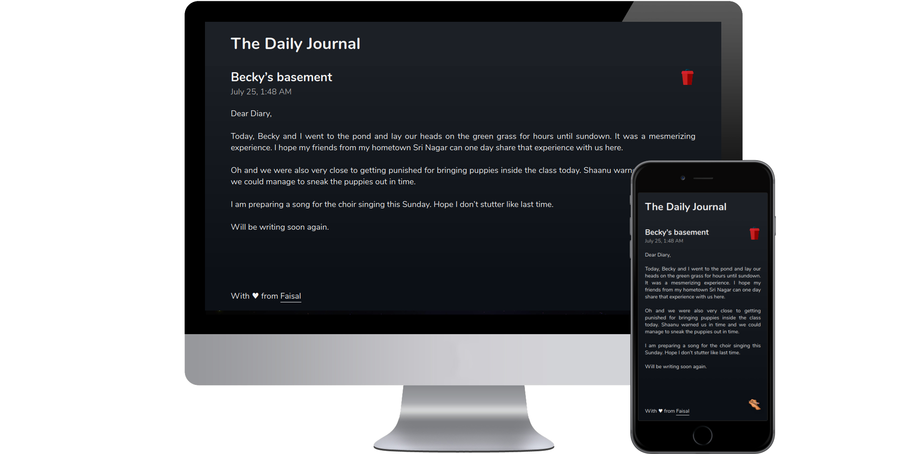
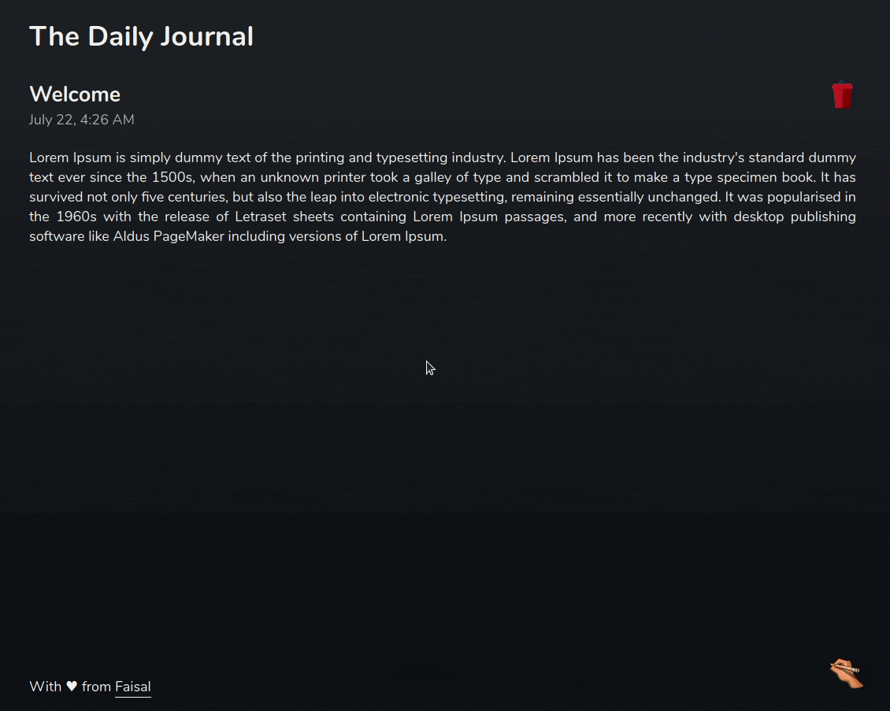
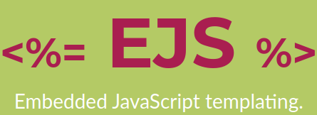

# Dear Diary

[](LICENSE)

<p align="center">
  
</p>

A fully responsive, cross-browser functional e-journal. It supports UTF-8 format, so you can use emojis and pour your hear out to your dearest diary. It comes with MongoDB to ensure fast access to the data(as it stores the working set in it's internal memory) and easily scalable database for multiple users, if need be.

A fully responsive, cross-browser functional e-journal with basic [functionalities](#features) to [create](#file-editor), [edit](#file-editor), [rename](#renaming-files) or [delete](#deleting-files) a file and [view it's information](#file-information) in a [discretely](#sign-in) allocated [space](#personal-file-space-allocated) for the user.

<p align="center">
  
  <br>
  Dear-diary
</p>


## Installation

### Requirements
[MongoDB ](https://npmjs.org/package/mongodb)
&emsp;
[Express ](https://npmjs.org/package/express)
&emsp;
[CORS ](https://npmjs.org/package/cors)

### Clone
- Clone this repo to your local machine using `git clone https://github.com/faisalAkhtar/mini-file-system`

### Setup
- Use `npm install` to install the dependencies first
- Then start using `node app.js`


## Contributing
### Step 1
- Option 1
  - :fork_and_knife: Fork this repository
- Option 2
  -  :dancers: Clone this repo to your local machine using ```git clone https://github.com/faisalakhtar/dear-diary.git```

### Step 2
- **HACK AWAY** :hammer: :hammer: :hammer:

### Step 3
- :repeat: Create a pull request using https://github.com/faisalakhtar/dear-diary/compare/


## Built with

&emsp;&emsp;&emsp;&emsp;&emsp;&emsp;&emsp;&emsp;


## Licensing

[](LICENSE)

All scripts, stylesheets and markups are distributed under the [MIT](LICENSE) license.

## Acknowledgements

- File management and handling was inspired from [Linux file systems](https://www.linux.org/)

- Hand clipart was taken from [here](https://svg-clipart.com/icon/oGK8NhS-hand-writing-clipart)

- Some icons in this READme were borrowed from [here](https://commons.wikimedia.org/wiki/Main_Page)

- CORS icon was taken from [mozilla](https://mozilla.org/) and is licensed under [Creative Commons Attribution Share-Alike License v3.0](https://creativecommons.org/licenses/by-sa/3.0/)
